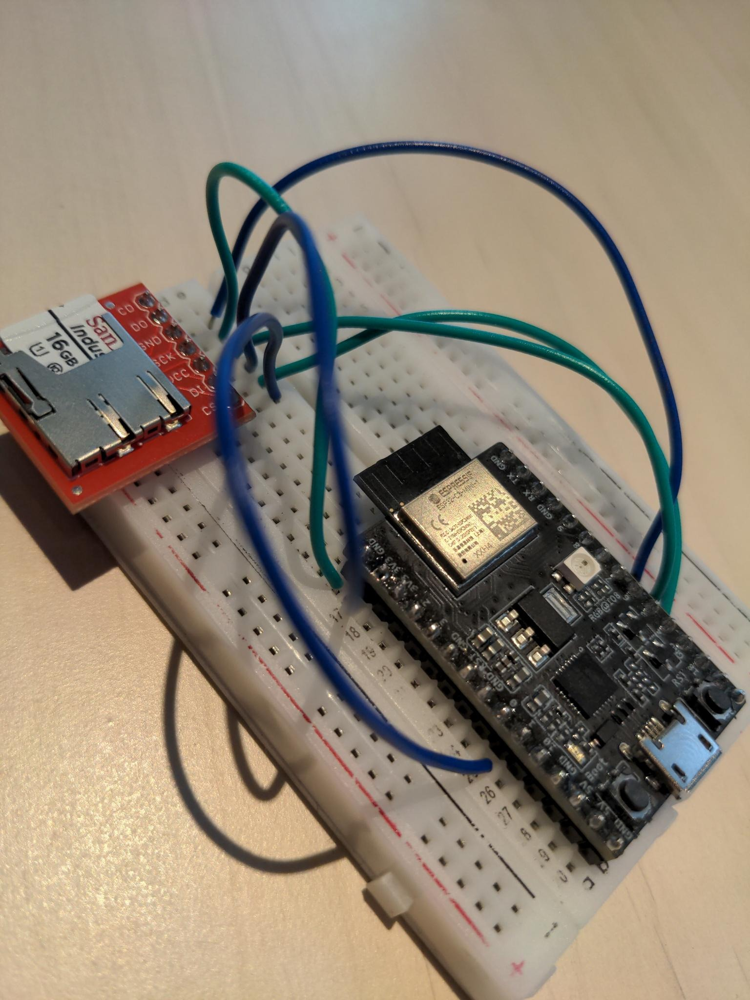

## Instructions to build and run the Sphinx Key signer

### Hardware setup

#### Picture



##### Sparkfun Shopping List

- ESP32-C3 Mini Development Board: https://www.sparkfun.com/products/18036
- SparkFun microSD Transflash Breakout: https://www.sparkfun.com/products/544
- Breadboard - Self-Adhesive (White): https://www.sparkfun.com/products/12002
- Break Away Headers - Straight: https://www.sparkfun.com/products/116
- Jumper Wire Kit - 140pcs: https://www.sparkfun.com/products/124

##### Soldering and SD Card Format

> **Warning**
> This signer currently does not work with SD cards that come with the UHS-I feature.

- You'll need a microSD card formatted using the FAT32 filesystem.
  - On MacOS, go to `Disk Utility`.
  - Click on the SDCard's disk in the left hand pane.
  - Click on the `Erase` button on the cetner top toolbar.
  - Then choose `MS-DOS (FAT)` for the format.
  - Finally click on `Erase`, at the bottom right of the dialogue box.
- Also make sure you have a micro-USB cable capable of transferring data.
- Once you have the parts, solder the breakaway headers to the microSD card board as shown in the picture above.

Now follow the table below and the picture above to make all the connections:

SD card pin | ESP32-C3-DevKitM-1 v1.0 | Notes
------------|-------------------------|--------------------
 DO         | GPIO2                   | Pin numbered 6 on board, same for the others below
 CS         | GPIO10                  | No need for any of the 10kOhm resistors mentioned in docs as of July 2022
 SCK        | GPIO6                   |
 DI         | GPIO7                   |
 VCC        | 3V3                     |
 GND        | GND                     |

### Software setup ( MacOS )

- Make sure you have the Apple Command Line Developer tools installed on your machine. If not, run `xcode-select --install`
- Install rust. You can grab the installation command at https://www.rust-lang.org/tools/install
- Install brew. Get the installation command at https://brew.sh/
- Install python3. You can run `brew install python3` if necessary.
- Run the following commands (the last one will take a while, go for a walk or something 😀):
```
pip install esptool
rustup install nightly
rustup component add rust-src --toolchain nightly
cargo install cargo-generate cargo-espflash ldproxy
```

### Hello World

Before we build and run the signer, we'll walk through a generic hello world to make sure the environment is all working:

- Type `cd ~`. This places you in your home directory. You can also cd into any other directory you want.
- Run the command below, and set the following settings when prompted: `Project Name=tiny-esp32, MCU=esp32c3, ESP-IDF native build version=v4.4, STD support=true, Configure project to use Dev Containers=false`
```
cargo generate --vcs none --git https://github.com/esp-rs/esp-idf-template cargo
```
- `cd tiny-esp32`
- Plug in the ESP32-C3 dev board to your computer via data-enabled micro-USB.
- `cargo espflash --monitor`
- Keep iterating through the ports displayed until you find one that works.
- This command builds and flashes the program onto the dev board, and then monitors the logs as soon as the program starts to run. By the end of execution, you should see a little `Hello World` log on your screen.
- Do a `ctrl-c` to quit the monitor. You are now ready to build, flash, and run the signer 🙂

### Signer

- `cd ~`
- `git clone https://github.com/stakwork/sphinx-key.git`
- `cd sphinx-key`
- `./deploy.sh`
- You will then be shown the logs of the signer.
- Wait for the message `Waiting for data from the phone!`. The LED should blink green.
- On your phone connect to the Wifi `sphinxkey`. This is served from the ESP32, and has no password.
> **Note**
> The sphinxkey network does not grant access to the internet, so ignore any warnings of that fact :)
- Launch the signer setup flow on the sphinx app, and input the following settings:

ESP IP address: `192.168.71.1`\
Broker IP address and port: `44.198.193.18:1883`\
SSID: ssid of a local wifi with access to the internet\
Password: password of the wifi from the previous step

- Once the setup is complete, the ESP will restart and attempt to connect to wifi.
- The LED will first blink yellow while it is connecting to the wifi.
- When the signer is pinging for the broker, the LED on the ESP blinks purple.
- On the logs, you should see `BROKER IP AND PORT` and `LED STATUS: ConnectingToMqtt`
- Soon after, the LED should start to blink white, which means your signer is now connected to your node, and is ready for normal operation.

### How to launch the signer again

- `cd ~/sphinx-key`
- `./deploy.sh`

### How to completely reset the signer

- Plug in your ESP to your computer.
- `esptool.py erase_flash`
- Next, unplug your ESP32 from your computer.
- Take out the SD card from its slot, and use your computer to clear all the data on it. Place it back in its slot after you've done so.
- You can now go to the section above to get going again.
